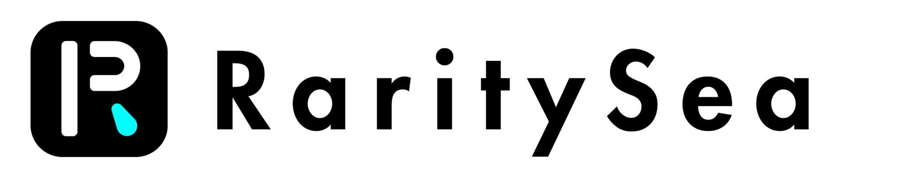
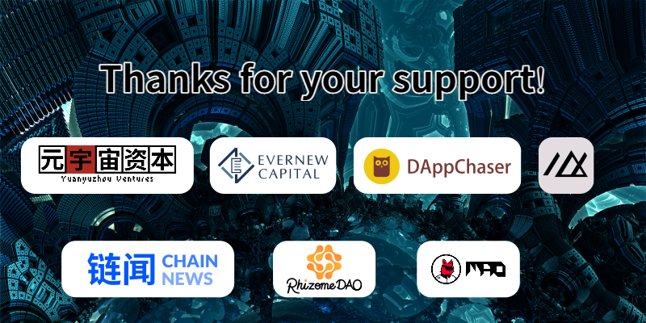

<div align="center">
	
	<br />
	<br />
</div>

<p align="center">
	<b>The NFT marketplace on Fantom</b>
</p>

<p align="center">
  Modified from: <a href="https://github.com/snowtigersoft/darksea-market">DarkSea Market</a>
</p>

<p align="center">
  Contributor: <a href="https://twitter.com/ChunHaoLee_">@ChunHaoLee_</a>、<a href="https://twitter.com/solomeowl444">SOLOMΞOWL</a>、<a href="https://twitter.com/snowtigersoft">@snowtigersoft</a>(DarkSea Market Author)
</p>
<p align="center">
❤ <a href="https://github.com/andrecronje/rarity">Rarity</a> ❤
<p align="center">
	 <a href="https://buidl.mirror.xyz/0I9oYGGKOxDrb2m8OjubyxjU4wYbs9Zp49c0IO2OwUc">Guild Waterdrop</a>
	🦾<a href="https://twitter.com/marrowdao">MarrowDAO</a>
</p>

# RaritySea
RaritySea is a P2P NFT marketplace for Rarity players. We will charge some fee of each sale, currently it is 10 percent.

## Live
Head to https://www.raritysea.io/ to try the live website.

## Warning
The smart contract written for this marketplace has not been audited, use at your own risk.

## Deployed Contracts

- RarityManifestedMarket: [0xE966c792B384ff4e82D13cc0C1Bd1D9C5FE68Fe4](https://ftmscan.com/address/0xE966c792B384ff4e82D13cc0C1Bd1D9C5FE68Fe4)
- RarityCraftingMarket: [0x93255ebf023c884bb6bee1ef8fd2b581aacce91e](https://ftmscan.com/address/0x93255ebf023c884bb6bee1ef8fd2b581aacce91e)

## Overview

The contracts are in `contracts/` folder, named `Market.sol` and `CraftingMarket.sol`. The deploy scripts are in `scripts/`. Check test scripts in `test/` folder to understand the working flow.

## Installation
```
npm install 
```

## Compile
```
npx hardhat compile
```

## Test
```
npx hardhat test
```

## Deploy and verify
1. Duplicate the `註記詞` and `私鑰` in hardhat.config.js to your own one.
2. Deploy contracts (remember to npx hardhat compile if you change the contracts)
```
npx hardhat run scripts/0-RarityManifestedMarket.js --network ftmMainnet
npx hardhat run scripts/1-RarityCraftingMarket.js --network ftmMainnet
```
3. Verify the contracts
```
npx hardhat verify --network ftmMainnet RarityManifestedMarket_address 1 5
npx hardhat verify --network ftmMainnet RarityCraftingMarket_address 1 5
```
 
## About Guild Waterdrop
Guild W is the first on-chain e-sports team, incubated by MarrowDAO. The main members are Solidity developers, node operators, blockchain game players and investment analysts. All of them are loyal players of the Dark Forest.
  
  <div align="center">
	
	<br />
	<br />
</div>
 
Recently, MarrowDAO has received funding from Yuanyuzhou Ventures, Evernew Capital, DAppChaser and EM3DAO, and ecological support from ChainNews, RhizomeDAO and MaoDAO. We will uphold the aim of peaceful development and help real blockchain games to grow and prosper.